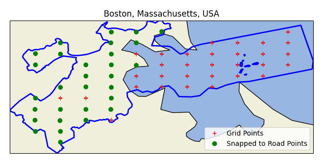

# Turn Sequence

## Summary

Analyze the frequency of taking alternating direction turns while driving vs. taking consecutive same-direction turns. Uses Google Geocode API and Routes API.

## Which Lane to Turn In?

If there are multiple lanes to take a turn, while lane should you choose?

The hypothesis is choosing the right-most lane when taking a left turn, or the left-most lane when taking a right turn is optimal on average. This is because when traveling, each turn is an overcorrection towards your destination. For a simple model, if we are traveling on a grid, then any optimal path will alternate between left and right turns. In practice, we still make multiple of the same direction turns in a row. But how often? This project aims to answer that question.

### Approach

To answer this question, paths are sampled between pairs of points in a city, count the number of left and right turns, and calculate the ratio of the number of left-then-right and right-then-left turns to the total number of turn pairs.

### How do you sample paths from a city?

- Use `osmnx` to generate a geometric polygon from the city
- Partition latitude and longitude into evenly spaced grid points equal to `map.granulariy` in `project_config.yaml`.
- Check if each grid point is in the city polygon. Toss it if it is not.
- Snap each grid point to the road with the Google Roads API.
    - If a point does not have a road nearby it is tossed. This is useful for city polygons like Boston's which have a large portion in the ocean.
- Loop over each pair of snapped points. If they are different, calculate the route betweenn them with the Google Routes API.
    - The number of calls to Google Routes is $O(\text{granularity}^4)$. Therefore the granularity should be chosen small, e.g. less than 10.
- Process the ouptut directions into a sequence of left and right turns.

## Analysis

### Results

Directions were calculated between every two pairs of distinct snapped points. For all directions, the alternating turn fraction was calculated:

$$
\frac{\text{num(LR)} + \text{num(RL)}}{\text{num(LL)} + \text{num(LR)} + \text{num(RL)} + \text{num(RR)}}.
$$

The alternating turn fraction was then averaged over all directions. For each city, the results are in the following table:

| Place                           | Alternating Turn Percentage |
|---------------------------------|-----------------------------|
| New York City, New York, USA    | 54.4%                       |
| Boston, Massachusetts, USA      | 54.9%                       |
| Philadelphia, Pennsylvania, USA | 53.9%                       |
| San Francisco, California, USA  | 65.6%                       |
| Los Angeles, California, USA    | 53.3%                       |
| Chicago, Illinois, USA          | 54.3%                       |
| Miami, Florida, USA             | 54.6%                       |
| London, UK                      | 43.3%                       |
| Paris, France                   | 52.9%                       |
| Amsterdam, Netherlands          | 50.6%                       |
| Berlin, Germany                 | 60.7%                       |
| Rome, Italy                     | 46.0%                       |
| Rio de Janeiro, Brazil          | 54.6%                       |
| Mumbai, India                   | 56.5%                       |
| Singapore                       | 51.0%                       |

### Visualization

To ensure we only calculate routes between points on roads, and not bodies of water for example, each grid point is snapped to the road using the Google Roads API. Points that are snapped to a road are shown as green. Points that were not able to snap to a road are in red. More plots are availible in the `plots/` directory.

### Conclusion

In all places except London, UK and Rome, Italy, the number of alternatting turns is higher than the number of consecutive same-direction turns. In San Francisco, USA, there are almost twice as many alternating turns as there are consecutive same-direction turns.

Therefore, when driving in these cities, if you take a right turn your next turn your next turn is most likely a left, and when taking a left turn your next turn is most likely a right.

In conclusion, use the right-most lane when taking a left turn and the left-most lane when taking a right turn.

## Installation

- Ensure that the UV package manager is installed.
- Set up environment: `uv sync`
- Build project `uv build`

## Data

Data is pulled from Google Roads and Routes APIs, processed, and stored in Google Sheets.

[Route data that I have processed and stored can be viewed as read-only here](https://docs.google.com/spreadsheets/d/1-AbBNuG1uom7djGymecf2jKBZFztmmOv9t5yPM3L354/edit?gid=1705379481#gid=1705379481).

It cost $264 of $300 of free Google Cloud credits to generate this data from the config in `sheet_config.yaml` with `granularity = 12`.

### Why Google Sheets?

While a SQL database would be more natural, Google Sheets has the convenient option of easily publically sharing the data as read only. 

## Re-Create Google Sheets Database

### API Key
To recreate the database, you need a [Google Cloud](https://console.cloud.google.com/) API key with access to the Google Sheets API, Google Drive API, Roads API, and Routes API.
1) Request a Maps Platform API Key.
2) Create a `.env` file in the root directory with `GOOGLE_MAPS_API_KEY=YOUR_ACTUAL_KEY`.
    - Optionally, if you would like to add write privileges to your email account for the Google Sheets database, add `EMAIL=YOUR_ACTUAL_EMAIL`.

### OAuth Credentials
OAuth credentials are required to write to Google Sheets.
3) Create a service account and generate a JSON key file.
4) Download the JSON file with your OAuth credentials, and save to `~/.credentials/sheets_oauth.json`, or specified the path in `project_config.yaml`.
